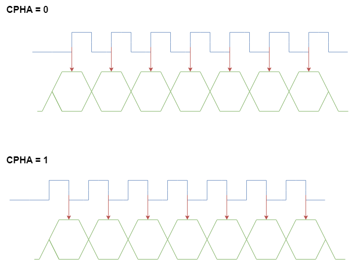

# STM32 Repository

## STM32 Overview

### What is an STM32?
The STM32 is a family of 32-bit microcontrollers based on the ARM Cortex-M architecture. STM32 microcontrollers are highly popular in embedded systems applications due to their high performance, power efficiency, and wide range of features. The STM32 series is divided into multiple sub-branches, each targeting different application requirements such as consumer electronics, automotive, industrial automation, and IoT.

### Features of STM32
1. **ARM Cortex-M Architecture**: STM32 boards are based on the ARM Cortex-M processor, offering a balance of performance and low power consumption.
2. **Peripherals**: STM32 microcontrollers feature a wide range of built-in peripherals, such as ADCs (Analog-to-Digital Converters), DACs (Digital-to-Analog Converters), timers, and communication interfaces including UART, SPI, I2C, CAN, etc.
3. **Development Environment**: STMicroelectronics provides several development tools such as STM32CubeIDE, STM32CubeMX (for configuration and initialization), and a rich set of firmware libraries, which facilitate ease of development and integration.

---

## Nucleo Board Series

The **Nucleo board** is a development board series created by STMicroelectronics, designed to allow easy experimentation and development with STM32 microcontrollers. Several variants of the Nucleo board exist, each featuring a different STM32 microcontroller, tailored for various performance requirements.

### Nucleo Board Variants:

#### NUCLEO-F0
- **Processor**: STM32F0 series (ARM Cortex-M0).
- **Target Applications**: Ideal for basic embedded control systems with minimal power and processing needs.
- **Key Features**: Low-cost, low-power, with support for basic peripheral interfaces like I2C, SPI, and UART.

#### NUCLEO-F3
- **Processor**: STM32F3 series (ARM Cortex-M4).
- **Target Applications**: Suitable for applications requiring a balance between power efficiency and performance, such as sensors, motor control, and real-time systems.
- **Key Features**: Includes digital signal processing (DSP) capabilities and hardware floating-point support, making it ideal for signal processing applications.

#### NUCLEO-F4
- **Processor**: STM32F4 series (ARM Cortex-M4).
- **Target Applications**: Higher performance requirements, such as audio processing, motor control, industrial applications, and robotics.
- **Key Features**: Built-in DSP instructions, advanced features for floating-point operations, and real-time control.

---

## Background: Understanding STM32 Operations and Applications

### Communication Interfaces

STM32 microcontrollers support a wide range of communication interfaces, enabling seamless integration with various peripheral devices and other microcontrollers. Some of the most common interfaces include:

#### SPI: Serial Peripheral Interface
SPI (Serial Peripheral Interface) is a synchronous communication protocol used for connecting microcontrollers to peripheral devices such as sensors, memory, or other microcontrollers. It uses a master-slave architecture and allows high-speed data transfer with minimal overhead.

##### Key Characteristics:
- Full-duplex communication.
- Multiple slave devices can be connected to one master.
- Four wires: MISO (Master In Slave Out), MOSI (Master Out Slave In), SCLK (Clock), and SS (Slave Select).

---

## ARM Cortex-M

### Purpose and Design
The **ARM Cortex-M** series of processors is designed to be energy-efficient, cost-effective, and ideal for embedded applications. It is optimized for real-time, low-power, and low-cost applications like microcontrollers, and is widely used in STM32-based devices.

### Features
- **32-bit RISC Architecture**: The Cortex-M series uses a Reduced Instruction Set Computing (RISC) architecture, making it more efficient and easier to implement.
- **Low Power Consumption**: The Cortex-M processors are designed to minimize energy use, making them ideal for battery-powered devices.
- **Built-in Debugging Features**: These processors come with integrated debugging support, such as hardware breakpoints, single-step execution, and a watchdog timer.

### Cortex-M Series Variants:
The STM32 series includes multiple variants of the Cortex-M cores, each optimized for specific needs:

#### Cortex-M0
- **Overview**: The simplest and smallest core in the Cortex-M series, optimized for low-cost, low-power embedded control tasks.
- **Applications**: Basic control systems and simple microcontroller tasks, such as light controllers and simple sensors.

#### Cortex-M3
- **Overview**: Designed to balance performance and power efficiency, providing more computational power than Cortex-M0, but still optimized for embedded systems.
- **Applications**: Mid-range embedded applications such as automotive systems, industrial control systems, and home automation.

#### Cortex-M4
- **Overview**: Includes support for Digital Signal Processing (DSP) operations and hardware floating-point operations, ideal for applications that require higher performance, such as audio and motor control.
- **Applications**: Robotics, audio systems, motor control, and complex data processing.

---

### Registers and Memory

Cortex-M processors have a simplified register structure that is easy to access and use for low-level programming. There are **16 general-purpose registers (R0 to R12)**, as well as three special-purpose registers:

1. **Link Register (LR)**: Stores the return address when calling a function or subroutine (used in assembly programming).
2. **Program Counter (PC)**: Points to the memory address of the next instruction to be executed. This can be thought of as the "step" in a program's flow.
3. **Stack Pointer (SP)**: Points to the last data element added to the stack or the first available address in the stack. The stack is used to store temporary data, like local variables and return addresses.

---

This repository is a work in progress to consolidate STM32 knowledge for use in a variety of embedded system applications, providing both beginners and experienced developers with the tools and information they need to get started and advance with STM32-based projects.

---